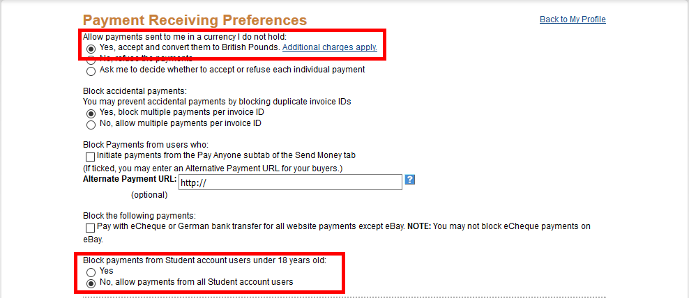

Setting Up PayPal
=============================

SDonate's method of dealing with PayPal payments has changed so you no longer need any API details. Existing users will need to follow these instructions to ensure their store doesn't stop working.

How to Set Up PayPal for SDonate
------------------------------------------------
1. Sign into your PayPal account at https://paypal.com.
2. Open `this link <https://www.paypal.com/cgi-bin/customerprofileweb?cmd=_profile-ipn-notify>`_ to go to the PayPal IPN settings
3. Click on the "Choose IPN Settings" button
4. Under "Notification URL" enter the URL of your store's "paypalipn.php" file. If you are using SDonate's free webstore, you can find this URL on the SDonate account page, next to "PayPal IPN URL". If you are using your own web server, enter the URL of your store and add "/paypalipn.php" at the end. So, if the URL of your store is "http://myamazingsite.com/donate/", enter "http://myamazingsite.com/donate/paypalipn.php" here.
5. Make sure "Receive IPN messages (Enabled)" is selected then click "Save".
6. Click on `this link <https://www.paypal.com/cgi-bin/customerprofileweb?cmd=_profile-pref>`_ to go to the PayPal blocked payments settings page. Make sure your settings look like this:

7. Go to https://sdonate.com and sign in, then go to "Account", then click on "Change PayPal Email Address".
8. Enter the email address of your PayPal account here (make sure you're entering the PRIMARY address of your PayPal account, meaning if you have more than one email address on your PayPal account, use the primary one) and click "Submit".

Test PayPal/How to Set Up PayPal Sandbox (Optional but Recommended)
-------------------------------------------------------------------------
If you want to test PayPal payments without using real money, you will need to set up "PayPal Sandbox".

1. You will need to create two sandbox accounts, a buyer and a seller, go to https://developer.paypal.com/ and log in using your normal PayPal account.
2. Click on `this link <https://developer.paypal.com/developer/accounts/>`_ to go to the sandbox account page.
3. Click on the "Create Account" button, then follow the settings guide below:

	* **Country** - Select the country that uses the SAME CURRENCY your store uses, so for example, if your store uses GBP, make sure "United Kingdom" is selected.
	* **Account Type** - Select "Personal (Buyer Account)"
	* **Email Address** - Enter email address you want, this doesn't need to be verified however it must be unique, you can't use the same email twice.
	* **Password** - Enter a password for the new account

4. Leave the rest of the settings as default, then click "Create Account". You've just made a test buyer account.
5. Create another account using the same settings as before, but this time set "Account Type" to "Business (Merchant Account)". This is your sandbox seller account.
6. Go to https://sandbox.paypal.com and log in using your SELLER sandbox account you just created then click `here <https://www.sandbox.paypal.com/uk/cgi-bin/webscr?cmd=_profile-ipn-notify>`_ to go to the IPN settings for your sandbox account.
7. Click "Edit Settings", then under "Notification URL" enter the URL of your store's "paypalipn.php" file. If you are using SDonate's free webstore, you can find this URL on the SDonate account page, next to "PayPal IPN URL". If you are using your own web server, enter the URL of your store and add "/paypalipn.php" at the end. So, if the URL of your store is "http://myamazingsite.com/donate/", enter "http://myamazingsite.com/donate/paypalipn.php" here.
8. Make sure "Receive IPN messages (Enabled)" is selected then click "Save".
9. To Enable sandbox testing mode on your store, first go to https://sdonate.com and sign in, then go to "Account", then click on "Change PayPal Email Address". Enter the email address of your sandbox SELLER account and click "Submit". Now go to your store's admin dashboard then to "General Settings". Change "PayPal Sandbox" to "Enabled" and submit.
10. To disable sandbox mode and enable real purchases go back to https://sdonate.com and change your PayPal email back to your real one, then go to your store's admin dashboard and change "PayPal Sandbox" back to "Disabled".

.. warning::
    Make sure you disable sandbox mode after you are done testing, otherwise people will be unable to purchase.
