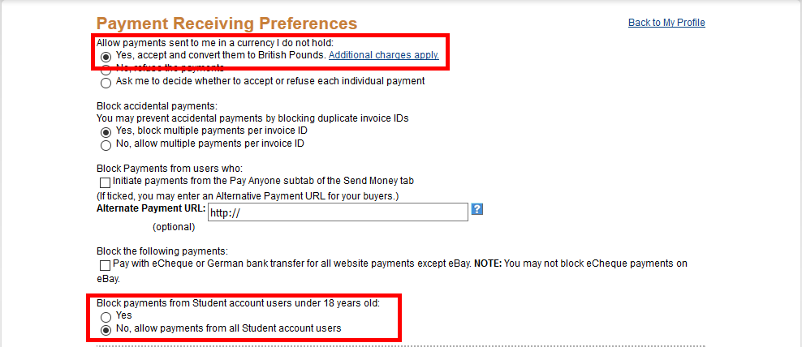
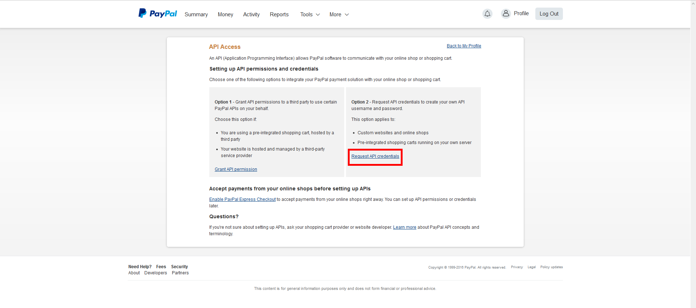
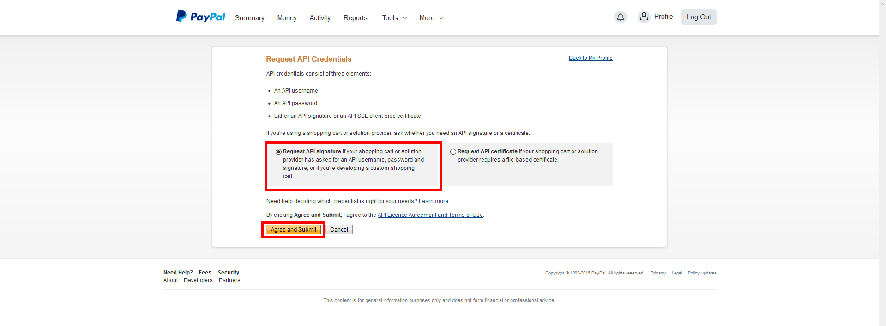
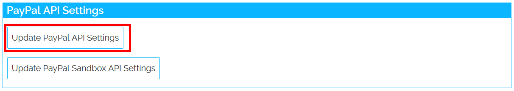
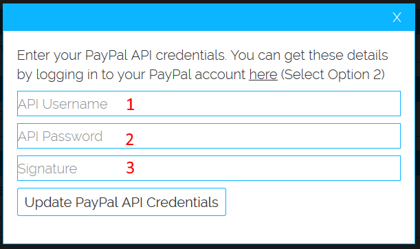
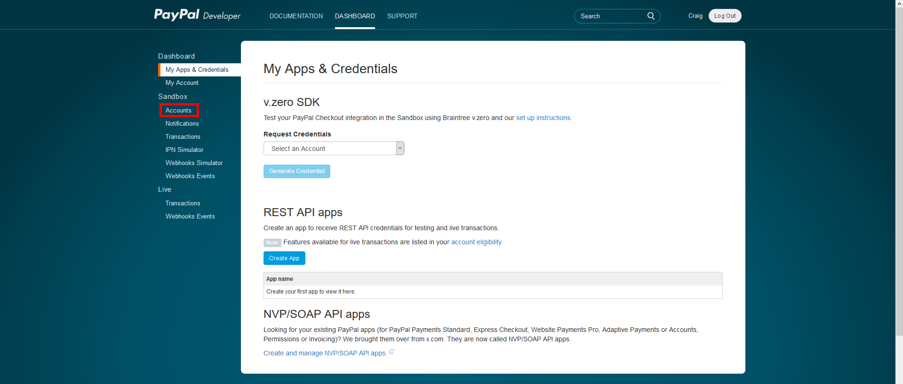
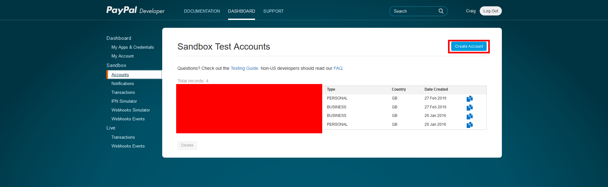
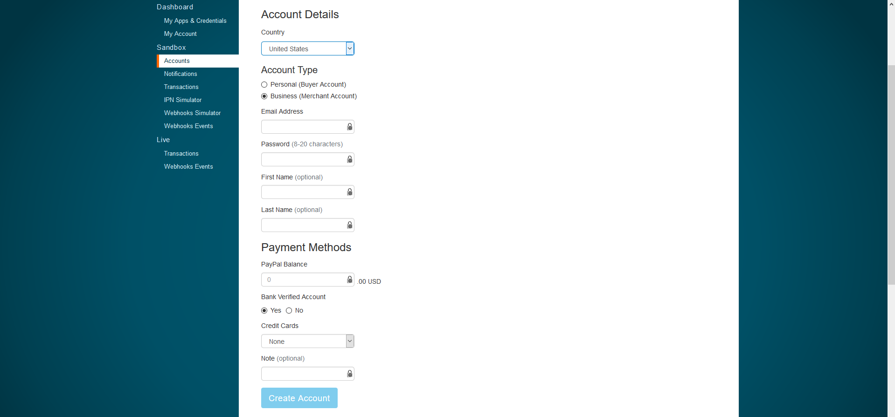
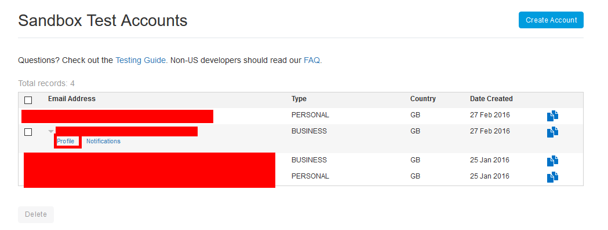
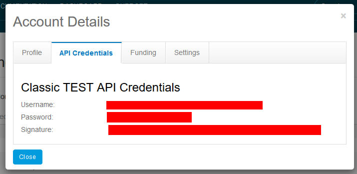

Setting Up PayPal
=============================

Before setting up PayPal, you should consider what payment mode you want to use:

* **Default** - People pay for their package at the point of purchase. To use this mode you will need to set up your PayPal API credentials as well as PayPal sandbox accounts.
* **Credit Only** - Setup is much more simple as you only need to enter your PayPal email address, but users need to go through the extra step of purchasing credits in order to purchase packages.

You can change Payment Mode in the "General Settings" tab of the admin dashboard.

Setting up PayPal for "Default" mode
------------------------------------------------
Sign into your PayPal account here: https://www.paypal.com/cgi-bin/customerprofileweb?cmd=_profile-pref and make sure your settings look the same as the picture below, then click "Save".

Now go here: https://www.paypal.com/cgi-bin/customerprofileweb?cmd=_profile-api-access and login to your PayPal account, then click on "Request API Credentials".

Now make sure "Request API Signature" is checked, then click on "Agree and Submit".

Now login using your Steam account at sdonate.com and go to your account page. Scroll down to "PayPal API Settings" and click on "Update PayPal API Settings".

Copy the "API Username", "API Password" and "Signature" generated on PayPal into the corresponding fields on the SDonate account page, then click "Update PayPal API Credentials".

.. image:: pppics/3.png

Now go to https://developer.paypal.com/ and log in using your PayPal account, then click on "Dashboard", then click on "Account" under Sandbox at the left side.

Now click on "Create Account" at the top right.

Select "Business (Merchant Account)" as the account type and MAKE SURE THE COUNTRY USES THE SAME CURRENCY AS YOUR MAIN STORE CURRENCY. Enter your email address (you can use the same one as your main PayPal account) and enter a password, then click on Create Account.

Now do the same again but this time choose "Personal (Buyer Account)" as the account type.

Once you have created both Sandbox accounts, click on "Profile" under the BUSINESS account.

Now go to your SDonate account page, click on "Update PayPal Sandbox API Settings", then enter these details and submit

Setting up PayPal for "Credit Only" mode
--------------------------------------------------
To set up PayPal using "Credit Only" mode, go to the "General Settings" tab of the admin dashboard, then change "Payment Mode" to "Credit Only", and enter your PayPal email address under "PayPal Email", then save. That's it, PayPal is setup!

Testing PayPal
-----------------------------
Testing PayPal will only work if you've set it up for "Default" mode, sandbox purchases of credits won't work. To enable PayPal sandbox mode, change "PayPal Sandbox" to "Enabled" in "General Settings". Now, purchase a package and sign in using your PayPal sandbox PERSONAL account to test it works. When sandbox mode is enabled, purchases can be made but no real money will actually be exchanged, so you can test without spending any money, just be sure to disable it to allow real donations.
