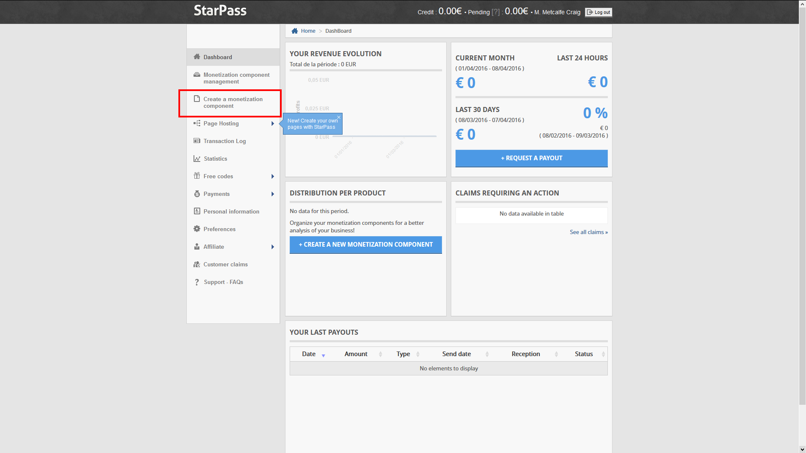
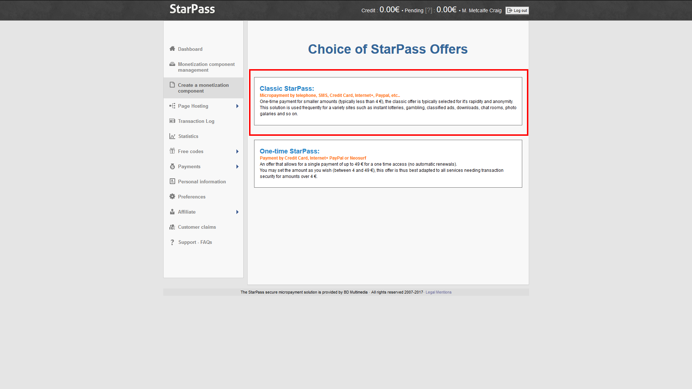
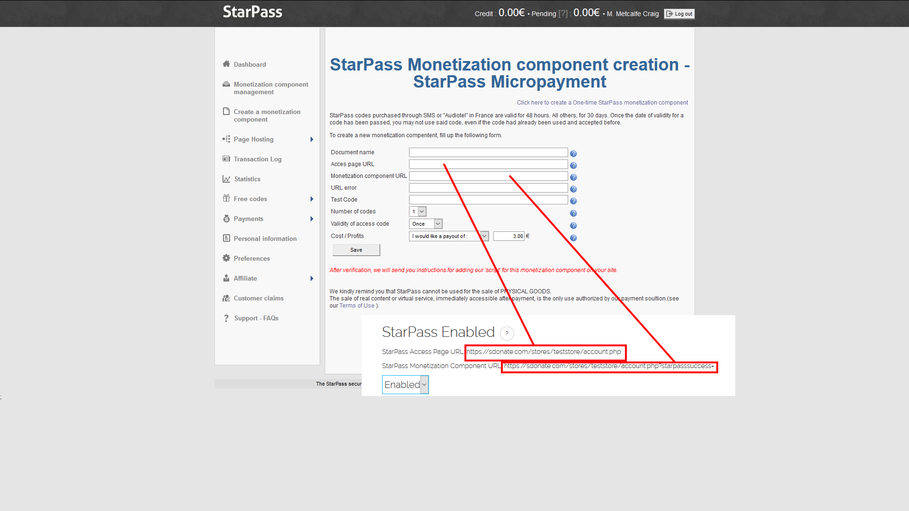
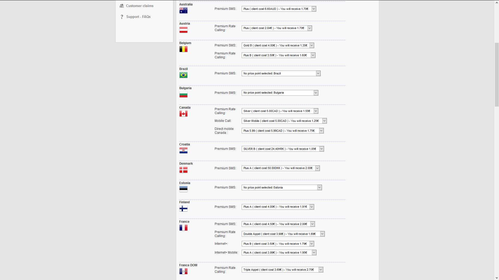
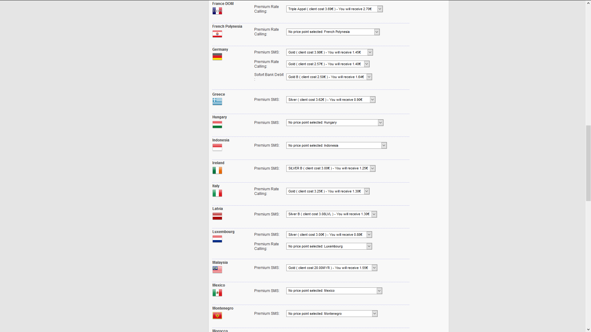
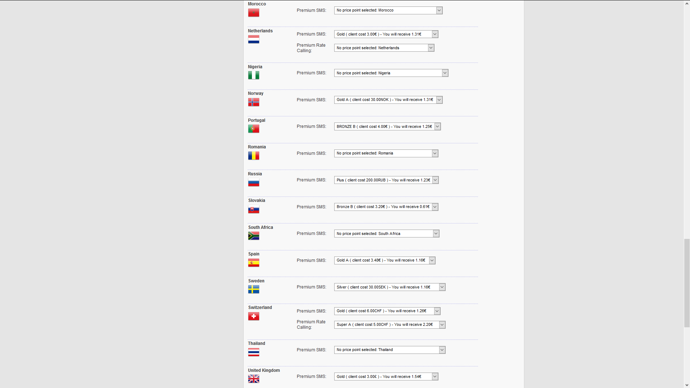
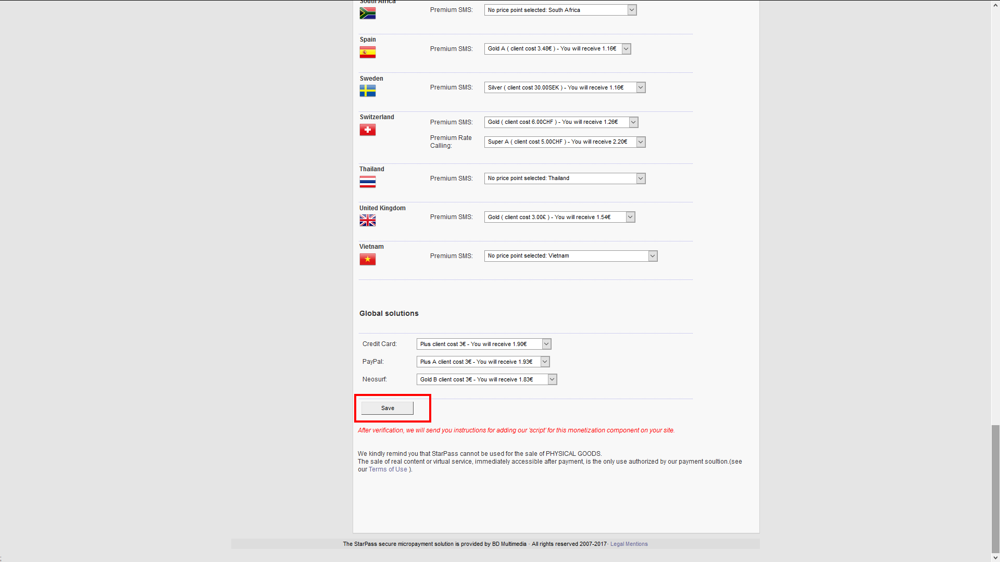
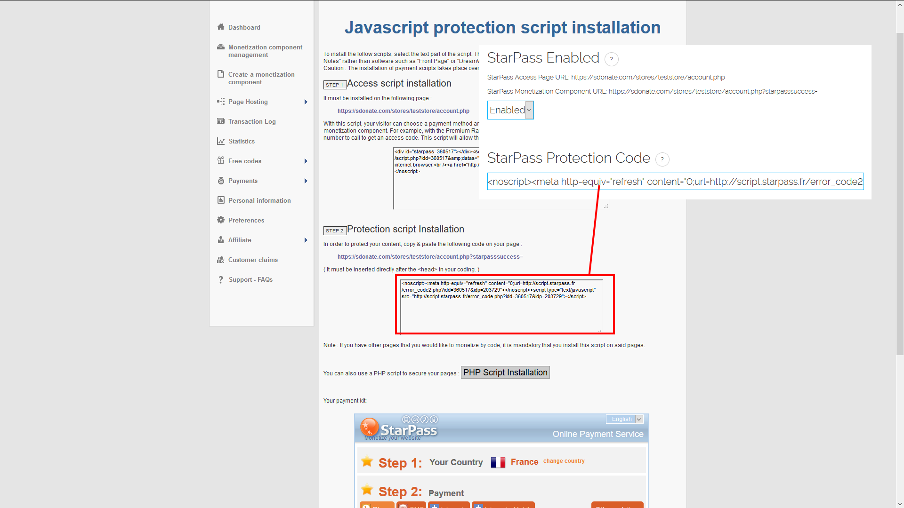

Setting Up StarPass
=============================

.. note::
    StarPass will only be available if your store's main currency is EUR/Euro. Currently, users can only use StarPass by using it to add €3 credit at a time, this is due to limitations with StarPass' API.

If you haven't already, create an account at http://starpass.fr and sign into it. Now, at the left hand side click on "Create a Monetization Component" or "Créer un document".

Now click on "StarPass CLASSIC".

Enter anything you want in "Document Name"/Nom du Document. Now go to your donation store, go to the admin dashboard and click on "General Settings". Scroll down and you will see "StarPass Access Page URL" and "StarPass Monetization Component URL". Copy these values into the corresponding fields on StarPass as shown in the picture below. Enter anything you want in "Test Code"/"Code de test", set "Number of codes"/"Nombre de codes" to 1, and "Validity of Access Code"/"Validité du code d\'accès" to once/1 fois. For "Cost/Profits" or "Coût / Gain" set it to "I would like a payout of"/"Je souhaite un reversement de" €3.00.

Now copy the settings in the pictures below:

Once you have saved these settings, copy the code from "Protection Script Installation"/"Installation du script de protection", go to your web store's admin dashboard, then "General Settings" and enter it under "StarPass Protection Code", make sure StarPass is enabled then submit your settings.

